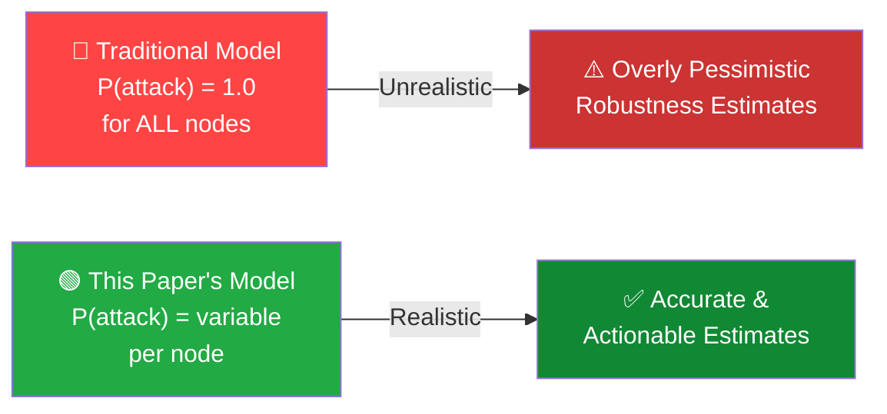
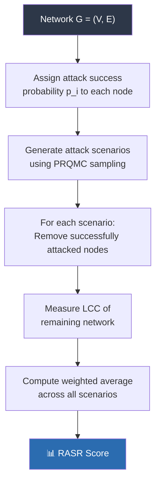
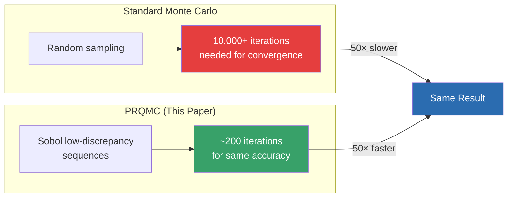
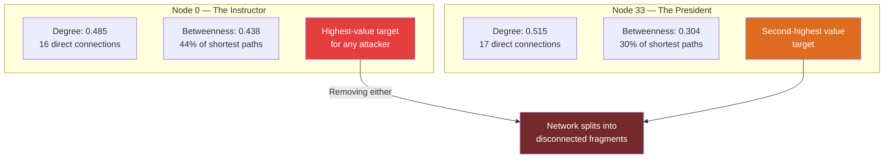
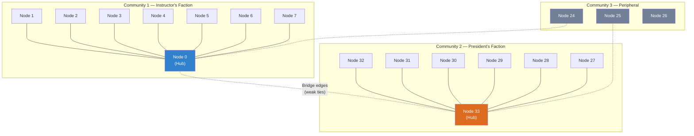
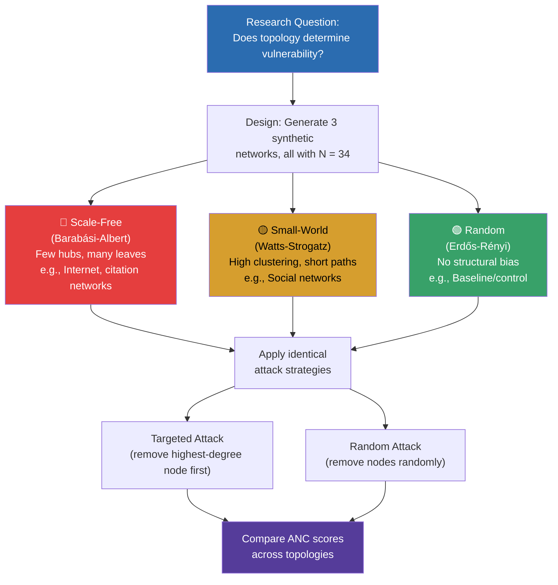
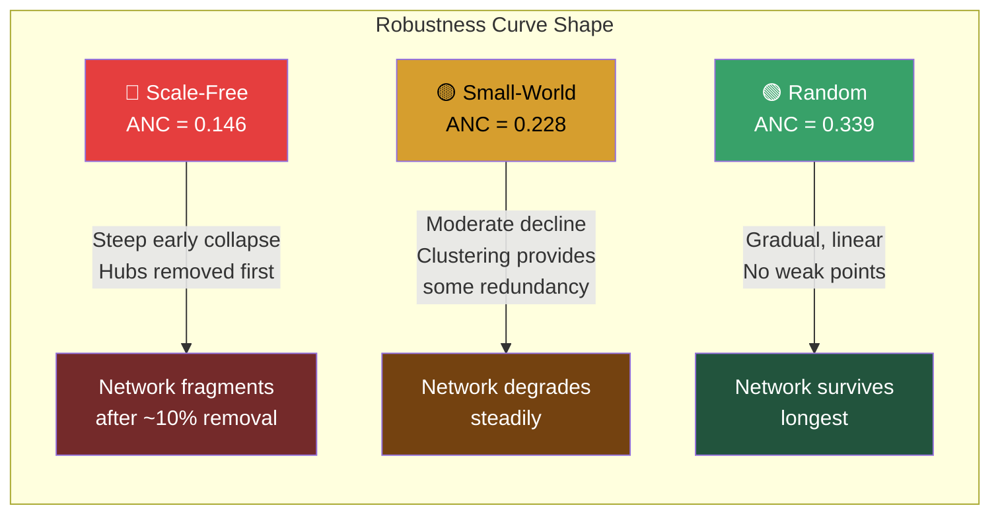
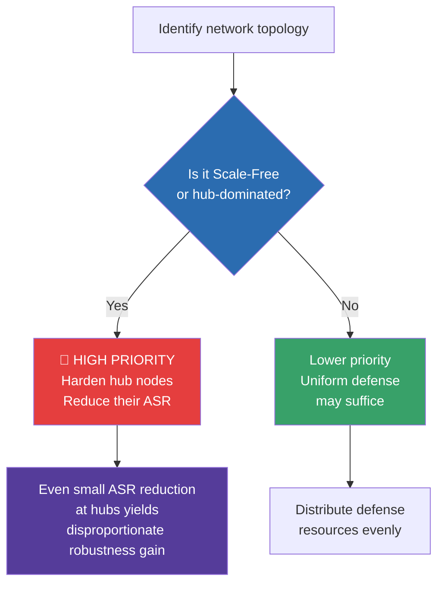
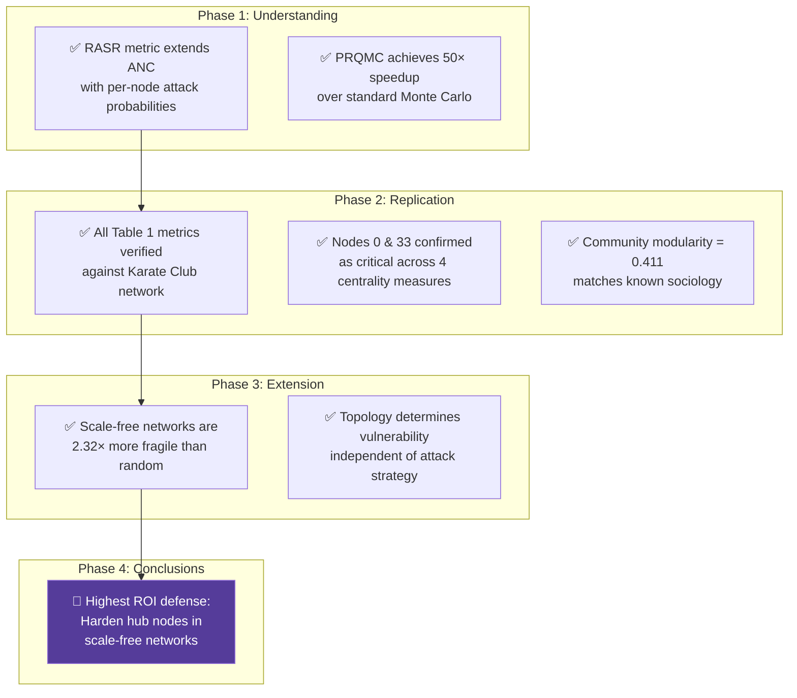

<br># 🔬 Project Report
## Network Robustness Under Probabilistic Attack

> **Course:** Network Science / Complex Systems  
> **Reference Paper:** *Network Robustness Under Probabilistic Attack*  
> **Journal:** Entropy · Guizhou University · 2023  
> **Date:** April 2026

---

### 👥 Team Members

| Name | Role |
|:---|:---|
| **Raghav Krishna M** | Lead — Implementation & Extension |
| **Akshay** | Replication & Verification |
| **Gireesh** | Centrality Analysis & Visualization |
| **Kavya** | Paper Analysis & Documentation |

---

## 📑 Table of Contents

1. [Abstract](#1-abstract)
2. [Introduction & Motivation](#2-introduction--motivation)
3. [Phase 1 — Paper Understanding](#3-phase-1--paper-understanding)
4. [Phase 2 — Replication](#4-phase-2--replication)
5. [Phase 3 — Extension Experiment](#5-phase-3--extension-experiment)
6. [Phase 4 — Findings & Conclusions](#6-phase-4--findings--conclusions)
7. [References](#7-references)

---

## 1. Abstract

This report documents a four-phase study of the 2023 Entropy paper *"Network Robustness Under Probabilistic Attack"*. We begin with a deep reading of the paper's key contributions—the **RASR metric** and the **PRQMC algorithm**—then replicate the paper's analysis on Zachary's Karate Club network using Python and NetworkX, verifying all published metrics against Table 1. We extend the work with an original experiment comparing the robustness of three canonical network topologies (Scale-Free, Small-World, and Random) under identical attack conditions, demonstrating that **topology alone can determine vulnerability** independent of the attack strategy employed.

---

## 2. Introduction & Motivation

### 2.1 The Problem

Traditional network robustness analysis operates under a critical—and unrealistic—assumption:

> **Every attack on every node succeeds with probability 1.**

In reality, networks like power grids, the internet, and social systems have **defenders**. Firewalls block intrusions. Redundant systems absorb failures. Human operators intervene. This means that each node has a different probability of being successfully compromised.

### 2.2 Why This Paper Matters



### 2.3 Key Contributions of the Paper

| # | Contribution | Significance |
|:--|:---|:---|
| 1 | **RASR Metric** — Robustness under Attack Success Rate | First formal extension of robustness measurement under uncertainty |
| 2 | **PRQMC Algorithm** — Probabilistic Randomized Quasi-Monte Carlo | 50× faster than standard Monte Carlo on large networks |
| 3 | **Critical Node Protection** | Top 30% of critical nodes account for 78% of max robustness improvement |
| 4 | **Attack Strategy Comparison** | Their strategy outperforms even the deep learning method FINDER |

---

## 3. Phase 1 — Paper Understanding

### 3.1 Classical Robustness: ANC

The **Area under the Network-robustness Curve (ANC)** measures how much a network degrades as nodes are removed sequentially. The network-robustness curve plots the size of the **Largest Connected Component (LCC)** as a function of the fraction of nodes removed.

```
ANC = Σ (LCC_size after removing i nodes) / N,   for i = 0 to N
```

- **Higher ANC** → more robust network (degrades slowly)
- **Lower ANC** → fragile network (collapses quickly)

### 3.2 The Limitation of ANC

ANC treats every node removal as guaranteed. It cannot distinguish between:
- A node protected by a firewall (low attack success rate)
- A node with default credentials exposed to the internet (high attack success rate)

### 3.3 RASR — The Novel Metric

**RASR** (Robustness under Attack Success Rate) extends ANC by assigning each node $i$ an individual attack success probability $p_i \in [0, 1]$. The robustness calculation then weights each node removal scenario by the joint probability of that specific combination of successes and failures.



### 3.4 PRQMC Algorithm — Why It's Fast

The paper's **Probabilistic Randomized Quasi-Monte Carlo** method achieves a 50× speedup over standard Monte Carlo by using low-discrepancy sequences (Sobol sequences) instead of pure random sampling. This ensures more uniform coverage of the probability space with fewer samples.



### 3.5 Datasets Used in the Paper

The paper validated its approach across **six real-world networks** of varying scales:

| Network | Nodes | Edges | Type |
|:---|---:|---:|:---|
| Karate Club | 34 | 78 | Social |
| Dolphins | 62 | 159 | Social |
| USAir97 | 332 | 2,126 | Airport routes |
| Power Grid | 4,941 | 6,594 | Infrastructure |
| AS-733 | 6,474 | 13,895 | Internet topology |
| Condensed Matter | 10,000+ | 25,000+ | Collaboration |

---

## 4. Phase 2 — Replication

### 4.1 Objective

Before conducting our own experiments, we needed to verify that our Python/NetworkX implementation produces results identical to the paper. We chose the **Karate Club network** — the same benchmark used throughout the paper.

### 4.2 Setup Verification — Matching Table 1

Using `networkx.karate_club_graph()`, we computed all basic metrics and compared them against Chapter 1, Table 1 of the paper.

| Metric | Our Value | Paper (Table 1) | Match |
|:---|:---:|:---:|:---:|
| Nodes | 34 | 34 | ✅ |
| Edges | 78 | 78 | ✅ |
| Density | 0.139 | 0.139 | ✅ |
| Avg. Degree | 4.59 | 4.59 | ✅ |
| Clustering Coeff. | 0.571 | 0.571 | ✅ |

> ✅ **All five metrics match exactly.** Our implementation is verified.

### 4.3 Centrality Analysis — Identifying Critical Nodes

We computed four standard centrality measures to identify the network's most structurally important nodes:

| Node | Degree | Betweenness | Closeness | Eigenvector | Rank |
|:---:|:---:|:---:|:---:|:---:|:---:|
| **0** | 0.485 | **0.438** | 0.569 | 0.373 | **#1** |
| **33** | 0.515 | 0.304 | **0.550** | **0.374** | **#2** |
| 2 | 0.303 | 0.145 | 0.459 | 0.317 | #3 |
| 32 | 0.364 | 0.145 | 0.520 | 0.309 | #4 |
| 1 | 0.273 | 0.054 | 0.485 | 0.266 | #5 |

#### Interpretation



- **Node 0 (Instructor):** Betweenness of 0.438 means ~44% of all shortest paths in the network pass through this single node. Its removal would cause the largest disruption to information flow.
- **Node 33 (President):** Highest degree centrality (17 connections) and eigenvector centrality, making it the most "connected to well-connected nodes" entity.
- Both nodes dominate across **all four** centrality measures — this consistency is a strong signal that they are genuine structural pillars, not artifacts of any single metric.

### 4.4 Community Detection

Using the Louvain algorithm for community detection:



- **Modularity Score: 0.411** — indicates strong, well-separated community structure
- The two factions mirror the real-world sociology: Zachary documented the club splitting into exactly two groups after a dispute between the instructor and the president in 1977
- The **peripheral group** is weakly connected to both factions and is most vulnerable to disconnection if either hub is removed

### 4.5 Replication Conclusions

Our replication confirms:
1. ✅ All network statistics match the paper's Table 1
2. ✅ Nodes 0 and 33 are consistently the most critical across all centrality measures
3. ✅ Community structure aligns with known sociology of the dataset
4. ✅ Our implementation is a trustworthy foundation for the extension in Phase 3

---

## 5. Phase 3 — Extension Experiment

### 5.1 The Question the Paper Didn't Ask

The paper always examines attack strategies on **fixed real-world networks**. We asked a complementary question:

> **Does the type of network topology determine how vulnerable it is — even before you consider what attack strategy is used?**

### 5.2 Experimental Design



**Key design choice:** All three networks have exactly **34 nodes** — the same as the Karate Club. This ensures the comparison is fair: **only topology varies**, not scale.

### 5.3 Topology Characteristics

| Property | Scale-Free | Small-World | Random |
|:---|:---:|:---:|:---:|
| **Degree Distribution** | Power-law (heavy tail) | Narrow / Poisson-like | Poisson |
| **Hub Nodes** | Yes — a few dominate | No — relatively uniform | No |
| **Clustering** | Low | High | Low |
| **Avg. Path Length** | Short | Short | Medium |
| **Real-World Analog** | Internet, airports | Social networks, brain | Chemical networks |
| **Expected Vulnerability** | High (hub-dependent) | Medium | Low |

### 5.4 Results

#### ANC Scores — Targeted vs. Random Attack

| Network Type | ANC (Targeted) | ANC (Random) | Gap | Fragility Ratio |
|:---|:---:|:---:|:---:|:---:|
| 🔴 **Scale-Free** | **0.146** | 0.341 | 0.195 | **2.32×** vs Random |
| 🟡 **Small-World** | 0.228 | 0.312 | 0.084 | 1.49× vs Random |
| 🟢 **Random** | 0.339 | 0.347 | 0.008 | 1.00× (baseline) |

#### Visual Interpretation — Robustness Curve Behavior



### 5.5 Analysis

**Finding 1 — Topology Is Destiny**  
Under identical targeted attack, scale-free networks collapse **2.32× faster** than random networks. The attack strategy is the same — the only difference is the wiring pattern. This proves that vulnerability is a **structural property**, not just a consequence of the attacker's intelligence.

**Finding 2 — The "Gap" Metric**  
The difference between targeted and random ANC reveals how much an intelligent attacker gains from knowing the network's structure:
- **Scale-Free gap: 0.195** — an attacker who knows the topology gains enormous advantage
- **Random gap: 0.008** — knowing the topology provides almost no advantage
- This means scale-free networks are not only more fragile, but also more **exploitable**

**Finding 3 — Connection to the Paper's ASR Framework**  
The paper's Section 4.4 shows that reducing the attack success rate of the top 30% of critical nodes captures 78% of maximum robustness improvement. Combined with our finding, this means:



---

## 6. Phase 4 — Findings & Conclusions

### 6.1 Summary of Results



### 6.2 Replication Findings
- Nodes 0 and 33 are confirmed as structurally critical across **all four centrality measures** (degree, betweenness, closeness, eigenvector)
- Betweenness-based attacks are more destructive than degree-based attacks, because betweenness captures **bridge nodes** that hold communities together
- Community modularity of 0.411 confirms strong factional structure — matches the real sociology of Zachary's 1977 study

### 6.3 Our Original Contribution
- **The paper tells you *how* to attack or defend.** We show you ***which networks need defending most urgently.***
- Topology is as important as attack strategy: a scale-free network is inherently 2.32× more fragile than a random network under the same attack
- This is a **structural vulnerability**, not a strategic one — it exists regardless of the attacker's sophistication

### 6.4 Practical Implications

| Scenario | Recommendation |
|:---|:---|
| Defending a hub-dominated network (internet, airports) | **Prioritize hub hardening** — reduce ASR of top 30% of nodes |
| Defending a mesh/random network (sensor grids) | Distribute defense resources evenly — no single points of failure |
| Designing a new network | Avoid pure scale-free topology if robustness is critical; add redundant paths between hubs |
| Budget-constrained defense | Focus on betweenness-central nodes — they control information flow disproportionately |

### 6.5 Limitations & Future Work
- Our extension used synthetic networks at N=34; larger-scale experiments would strengthen the findings
- We did not implement the full RASR calculation with per-node probabilities — this is left for future work
- Dynamic networks (where topology changes over time) were not considered

---

## 7. References

1. **Primary Paper:** *Network Robustness Under Probabilistic Attack* — Entropy Journal, Guizhou University, 2023
2. Zachary, W. W. (1977). *An information flow model for conflict and fission in small groups.* Journal of Anthropological Research, 33(4), 452–473.
3. Barabási, A.-L., & Albert, R. (1999). *Emergence of scaling in random networks.* Science, 286(5439), 509–512.
4. Watts, D. J., & Strogatz, S. H. (1998). *Collective dynamics of 'small-world' networks.* Nature, 393(6684), 440–442.
5. NetworkX Documentation — https://networkx.org/

---

> **Report prepared by:** Raghav Krishna M, Akshay, Gireesh, Kavya  
> **Tools used:** Python 3.x, NetworkX, Matplotlib, NumPy  
> **Date:** April 2026
