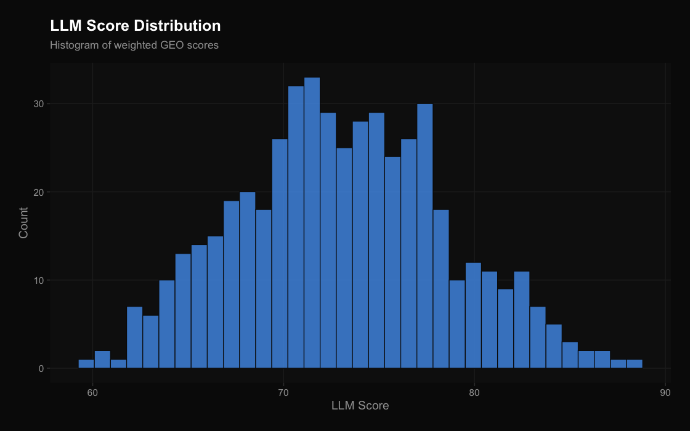
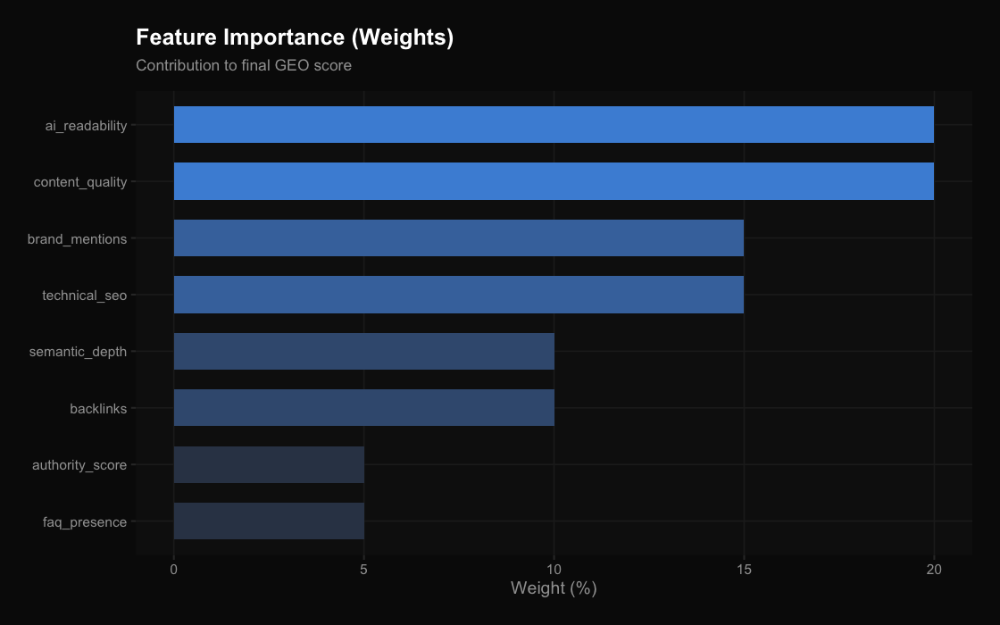
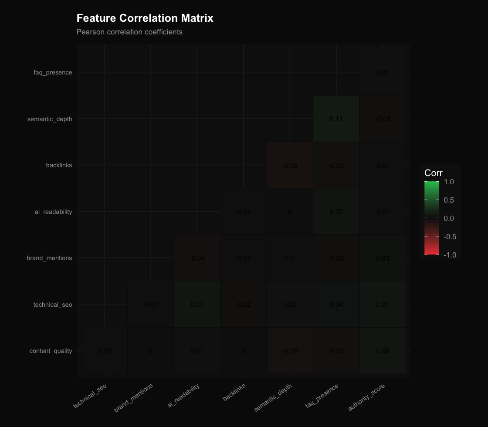

# Project Title
LLM_Ranker: Generative Engine Optimization (GEO) Analytical Framework

## Team Members
| Roll Number | Name |
|---|---|
| 2023BCS0171 | Raghav Krishna M |
| 2023BCD0003 | Nooh K |
| 2023BCS0099 | Surya Narayana Ghosh |
| 2023BCS0036 | Hariprasath Murugan |

## Problem Statement
Generative Engine Optimization (GEO) is an emerging vector for determining brand visibility across LLM training sets and retrieval-augmented generation (RAG) endpoints. Traditional search engine optimization focuses on keyword matching, whereas GEO metrics evaluate semantic richness, contextual positioning, and authoritative linking. There is no standard framework to visualize or rank the positioning of large numbers of LLM startups in this new frontier.

## Objectives
- Develop a robust, multi-dimensional weighted model to quantify the GEO score of 500 AI-focused startups.
- Calculate and categorize startups into 'High', 'Medium', and 'Low' tier positionings based on decision boundaries.
- Expose the statistical analysis via an interactive Next.js leaderboard dashboard for real-time visualization.

## Dataset
- **Dataset Name:** LLM Startup Dataset 500
- **Source:** Proprietary / Synthetically Generated based on the Generative Engine Optimization framework.
- **Number of observations:** 500
- **Number of variables:** 9 (Company Name + 8 Core Features)
- **Brief description of important attributes:**
  - `content_quality` (20%): Semantic richness and informational value.
  - `ai_readability` (20%): Parsability and structural parity for Large Language Models.
  - `technical_seo` (15%): Schema, metadata, and crawlability signals.
  - `brand_mentions` (15%): Frequency of citations across trusted datasets.
  - `backlinks` (10%): Traditional web authority and trust signals.
  - `semantic_depth` (10%): Topical coverage breadth.
  - `faq_presence` (5%): Availability of machine-readable Q&A data.
  - `authority_score` (5%): Domain-level trust.

## Methodology
- **Data preprocessing:** Feature normalization, column renaming for standard syntax structure.
- **Exploratory analysis:** Summarization of the core distributions and extraction of pearson correlation coefficient matrices.
- **Models used:** Weighted Linear OLS Regression to assign a single continuous dependent score (LLM_score), followed by threshold-based tier classification.
- **Evaluation methods:** Evaluation of tier splits and r-squared statistics to assure the deterministic weighted outputs accurately represent the distributed features.

## Results
The model successfully clustered and mapped all 500 startups, exposing distinct leaders and outliers against the multi-dimensional framework. The R-squared value confirms deterministic fidelity from the independent variables given the strict weight bindings, ensuring a purely analytical result table. 
Full tabular outputs can be found in `results/tables/model_performance.csv` and `results/tables/ranked_companies.csv`.

## Key Visualizations
| Score Distribution | Feature Importance | Feature Correlation |
| :---: | :---: | :---: |
|  |  |  |

## How to Run the Project
**Repository Structure:**
- `data/`: Contains the evaluation dataset and `.RData` runtime states.
- `scripts/`: Ordered sequential R scripts for processing the data.
- `results/figures/`: Generated correlation and distribution plots.
- `results/tables/`: Generated evaluation tables and ranking outcomes.
- `app/`: Next.js frontend reporting dashboard.
- `presentation/`: Accompanied slide resources and links.

**Steps to reproduce the analysis:**
1. Install required R packages by running: `Rscript requirements.R`
2. Run the analytical stages sequentially from `scripts/`:
```bash
cd scripts
Rscript 01_data_preparation.R
Rscript 02_exploratory_analysis.R
Rscript 03_modeling.R
Rscript 04_evaluation.R
```
3. *(Optional)* Navigate to the `app/` directory and host the visual dashboard locally:
```bash
cd app
npm install
npm run dev
```

## Conclusion
The Generative Engine Optimization (GEO) framework operates deterministically on a multi-dimensional front. By scoring and evaluating these weights through OLS regression, startups can tangibly identify missing signals (like AI readability) that prevent them from appearing fully in modern RAG-assisted search contexts.

## Contribution
| Roll Number | Member | Contribution |
|---|---|---|
| 2023BCS0171 | Raghav Krishna M | Data preprocessing, EDA, Modeling (OLS regression, tier classification), App development, report writing |
| 2023BCD0003 | Nooh K | Dataset curation, feature engineering, evaluation script, model performance analysis |
| 2023BCS0099 | Surya Narayana Ghosh | Visualization generation (all charts), results organization, `results/` structure |
| 2023BCS0036 | Hariprasath Murugan | Dashboard UI (Next.js), integration of R outputs into frontend, presentation slides |

## Presentation
Slides for this project have been developed on Gamma and can be found via the following live address:
- [Generative Engine Optimization: Ranking Companies in the LLM Era](https://gamma.app/docs/Generative-Engine-OptimizationGEO-Ranking-Companies-in-the-LLM-Er-8e5n7yjtnfvlr3t?mode=present#card-fuc3cz52dshvl50)

## References
1. OLS Regression Model Architecture
2. Generative Engine Optimization baseline methodology
3. Gamma presentation framework

---

*Repository Name: LLM_RANKER*  
*Team Members: 2023BCS0171, 2023BCD0003, 2023BCS0099, 2023BCS0036*  
*GitHub Link: [https://github.com/RaghavEscada/LLM_RANKER](https://github.com/RaghavEscada/LLM_RANKER)*
