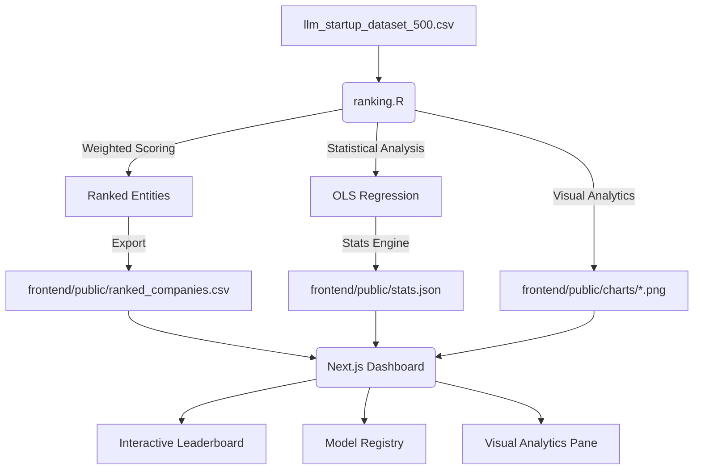
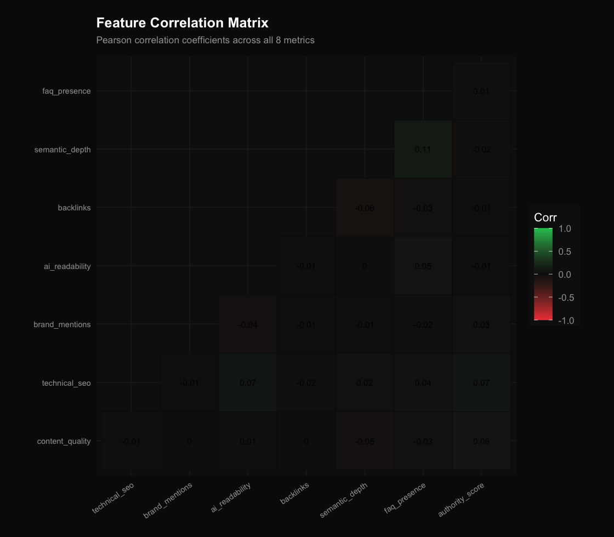

# LLM_Ranker | GEO Analytical Dashboard

> [!NOTE]
> **GEO (Generative Engine Optimization)** is a novel framework for measuring how effectively a brand or entity is represented in Large Language Model (LLM) training sets and retrieval contexts.

LLM_Ranker is a professional-grade analytical tool designed to score, rank, and visualize the "visibility" of 500+ LLM startups. Combining a robust **R-based statistical engine** with a high-performance **Next.js dashboard**, it provides real-time insights into market positioning through a weighted multi-dimensional model.

---

## 🏗 Full-Stack Architecture

The project implements a decoupled data pipeline, ensuring high-fidelity analysis and a fluid user experience.



---

## ⚖️ The GEO Scoring Model

The ranking is driven by a **Weighted Linear OLS Regression** model implemented in R. Each entity is scored based on 8 core dimensions:

| Dimension | Weight | Description |
| :--- | :--- | :--- |
| **Content Quality** | 20% | Semantic richness and informational value. |
| **AI Readability** | 20% | Parsability and structural clarity for LLMs. |
| **Technical SEO** | 15% | Schema, metadata, and crawlability signals. |
| **Brand Mentions** | 15% | Frequency of citations across trusted datasets. |
| **Backlinks** | 10% | Traditional web authority and trust signals. |
| **Semantic Depth** | 10% | Topical coverage and specialized knowledge. |
| **FAQ Presence** | 5% | Availability of machine-readable Q&A data. |
| **Authority Score** | 5% | Domain-level credibility and historical trust. |

---

## 📊 Visual Insights

Our R engine generates high-fidelity visualizations to aid in data exploration:

| Score Distribution | Feature Correlation |
| :---: | :---: |
|  |  |

> [!TIP]
> All charts are exported with a high-contrast dark theme optimized for professional dashboards and presentations.

---

## 🚀 Getting Started

### Prerequisites
- **R** (with `ggplot2`, `ggcorrplot`, `scales`)
- **Node.js** (v18+) & **npm**

### Data Analysis (The Engine)
Run the R script to process the dataset and generate the latest scores and charts:
```bash
Rscript ranking.R
```

### Dashboard (The UI)
Navigate to the frontend directory and start the development server:
```bash
cd frontend
npm install
npm run dev
```
Open [http://localhost:3000](http://localhost:3000) to view the GEO Dashboard.

---

## 📂 Repository Structure

- `ranking.R`: Core analytical engine and visualization script.
- `llm_startup_dataset_500.csv`: Raw input data.
- `frontend/`: Next.js 16 + Tailwind CSS dashboard.
  - `app/`: React components and layouts.
  - `public/`: transient data registry (CSV, JSON, Charts).
- `assets/`: high-resolution project assets and banners.

---

## 📍 Future Roadmap

- [ ] **K-Means Clustering**: Group startups by behavioral archetypes.
- [ ] **GLM Integration**: Model tier probability shifts.
- [ ] **Real-time API**: Integrate with live news feeds for dynamic ranking updates.
- [ ] **PCA**: Principal Component Analysis for feature sensitivity.

---

*Developed as a professional demonstration of R-JS data pipelines by Raghav.*
